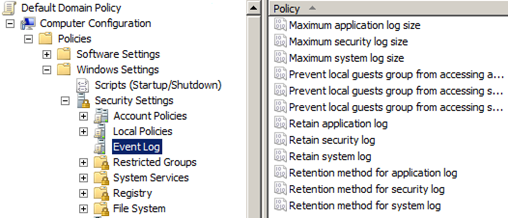

# Continuation from slide 44 of lecture 4 slides (theory)  

## Objectives
Intro to GP  

## Supplimentary video for GPO precedence
[link](https://www.youtube.com/watch?v=orQns7K-brM)

## Navigation
* [Intro to GP](#introduction-to-group-policy-gp)
* [Securing Win Server 2016 using Security Policies](#win-server-2016-using-security-policies)

### Introduction to Group Policy (GP)

GP in Win Server 2016 allows standardization of working environment of clients and servers via policies in AD.   

#### Characteristics of GP

* Can be set for a <b>site</b>, <b>domain</b>, <b>OU</b>, or <b>local computer</b>
* Cannot be set for non-OU folder containers
* Settings are stored in GPO
* GPOs can be local and nonlocal
* Can be set up to affect all user accounts and PCs
* When GP is updated, old policies are removed or updated for all clients

PC configuration applies to computers  

User configuration applies to users  

### Win Server 2016 using Security Policies

Security policies are a subset of individual policies within a larger GP for a site, domain, OU, or local PC

#### Security policies

* <b>Account Policies</b>
* Audit Policy
* <b>User Rights</b>
* Security Options
* IP Security Policies (IPSec)

